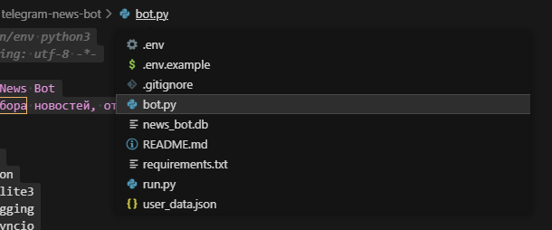
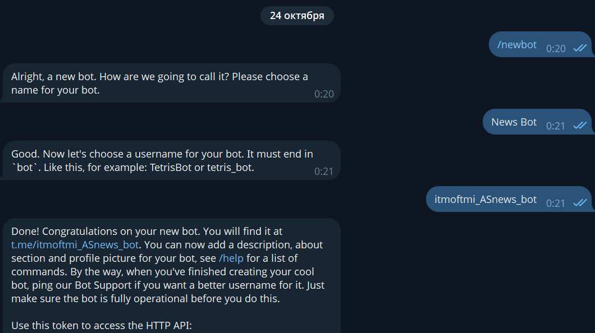
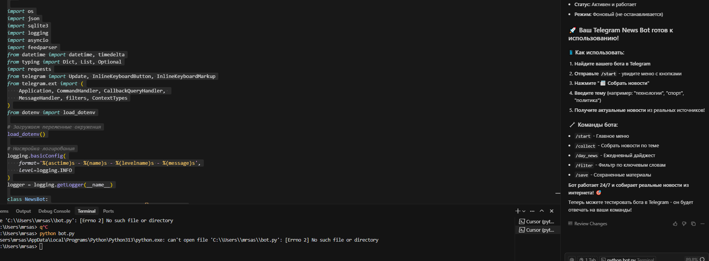
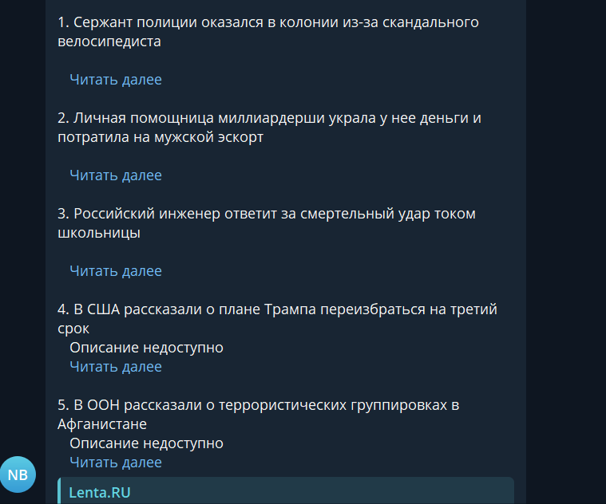

University: [ITMO University](https://itmo.ru/ru/)  
Faculty: [FTMI](https://FTMI.itmo.ru)  
Course: [Vibe Coding: AI-боты для бизнеса](https://github.com/itmo-ict-faculty/vibe-coding-for-business)  
Year: 2025/2026  
Group: U4225  
Author: Budaev Alexandr Sayanovich
Lab: Lab1  
Date of create: 24.10.2025  
Date of finished: 24.10.2025  

---

## 🔹 Тема лабораторной
**Создание первого Telegram-бота без программирования**  
Бот: `@itmoftmi_newsbot`  
Название: **Telegram News Bot**

---

## 🔹 Описание задачи
Цель работы — создать Telegram-бота, который собирает и отправляет пользователю актуальные новости по выбранным темам.  
Задача решает проблему экономии времени: пользователю не нужно искать новости вручную — бот делает это автоматически, фильтруя их по интересам.

---

## 🔹 Выбранный тип бота
**Бот-агрегатор информации**  

Функционал:
- Собирает новости по определённым темам  
- Отправляет ежедневные дайджесты  
- Фильтрует информацию по ключевым словам  
- Сохраняет интересные материалы

---

## 🔹 Промпт для LLM

### Исходный промпт
Создай Telegram-бота на Python с использованием библиотеки python-telegram-bot.

Функционал бота:
- Собирает новости по темам
- Отправляет ежедневные дайджесты
- Фильтрует информацию по ключевым словам
- Сохраняет интересные материалы
- Команды:
/collect — собрать новости
/day_news — ежедневный дайджест
/filter — фильтр по ключевым словам
/save — сохранённые материалы

Требования:
- Простота интерфейса
- Код с комментариями
- Использовать SQLite
- Обработка ошибок

Создай:
- bot.py
- requirements.txt
- README.md
- .env.example

### Итерации
1. Добавлена поддержка **реальных новостей** через RSS (Lenta, Газета, РИА, Коммерсант).  
2. Исправлены ошибки `AttributeError` при обработке callback-запросов.  
3. Добавлено логирование и обработка устаревших запросов (`BadRequest: query is too old`).  
4. Добавлена библиотека `feedparser` и SQLite-хранилище.  

### Финальный промпт
Создай Telegram-бота на Python (python-telegram-bot v21) с поддержкой RSS-новостей (feedparser),
фильтрацией по ключевым словам, базой данных SQLite и командами /collect, /day_news, /filter, /save.
Добавь обработку ошибок и логирование.

---

## 🔹 Стек технологий
| Компонент | Использование |
|------------|----------------|
| **Python 3.13** | основной язык |
| **python-telegram-bot v21.0** | Telegram API |
| **feedparser 6.0.11** | получение новостей из RSS |
| **requests 2.31.0** | сетевые запросы |
| **sqlite3** | база данных новостей |
| **python-dotenv 1.0.0** | работа с .env |
| **logging** | логирование ошибок |

---

## 🔹 Структура проекта

---

## 🔹 Скриншоты и видео
- Скриншоты:  

- 
- 
- 
- Видео-демо: https://drive.google.com/file/d/1v7dLHZwXyKCdgyNmFaRawMfHXQYjkMMm/view?usp=sharing

---

## 🔹 Трудности и решения
| Проблема | Решение |
|-----------|----------|
| Ошибка `InvalidToken` | обновил .env, добавил реальный токен |
| `401 Unauthorized` при запросе News API | заменил на RSS-источники |
| `AttributeError: NoneType has no reply_text` | добавлена проверка на тип update |
| `BadRequest: Query is too old` | реализован try/except с `query.answer()` |

---

## 🔹 Выводы
✅ Бот успешно создан и работает в Telegram  
✅ Реализованы все команды и функции  
✅ Используется реальный сбор новостей из интернета  
✅ Получен практический опыт работы с LLM и python-telegram-bot  
💡 В дальнейшем можно добавить:
- Отправку новостей по расписанию (cron)
- Подписку по темам
- Веб-панель администратора

