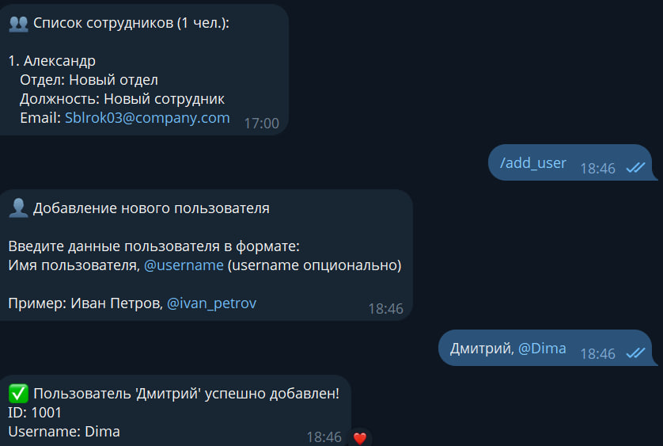
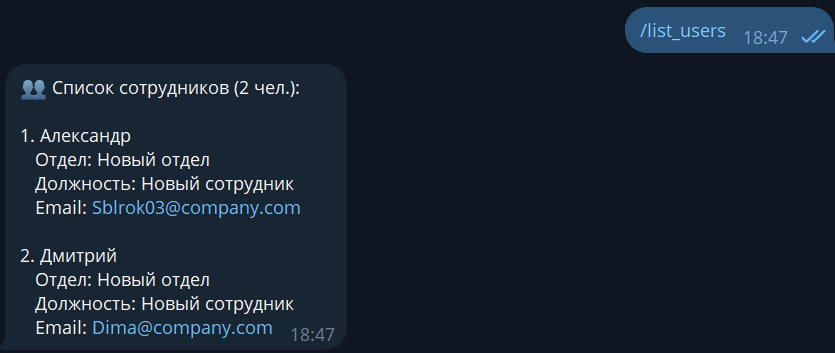
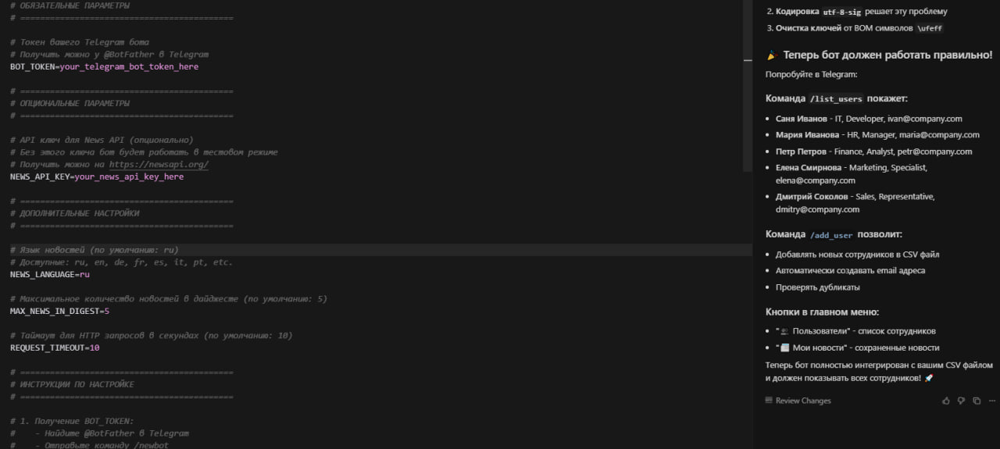

University: [ITMO University](https://itmo.ru/ru/)  
Faculty: [FTMI](https://FTMI.itmo.ru)  
Course: [Vibe Coding: AI-боты для бизнеса](https://github.com/itmo-ict-faculty/vibe-coding-for-business)  
Year: 2025/2026  
Group: U4225  
Author: Budaev Alexandr Sayanovich
Lab: Lab2  
Date of create: 24.10.2025  
Date of finished: 24.10.2025  

---
## 🔹 Тема лабораторной
**Улучшение Telegram-бота: добавление работы с базой данных SQLite**

---

## 🔹 Цель работы
Научиться интегрировать Telegram-бота с локальной базой данных SQLite для хранения информации о пользователях и сохранённых новостях, а также реализовать команды для взаимодействия с этими данными.

---

## 🔹 Описание интеграции
Для хранения данных о пользователях и новостях используется **SQLite** — встроенная в Python база данных.  
Бот автоматически создаёт базу и необходимые таблицы при запуске.  
Данные сохраняются между перезапусками, что позволяет сохранять историю взаимодействий пользователей.

---

## 🔹 Структура данных

**Файл:** `bot.db`

**Таблицы:**
1. **users**  
   - `id` — уникальный идентификатор  
   - `name` — имя пользователя  
   - `username` — никнейм Telegram  

2. **news**  
   - `id` — уникальный идентификатор  
   - `user_id` — ID пользователя  
   - `title` — заголовок новости  
   - `url` — ссылка  
   - `date` — дата добавления  

---

## 🔹 Промпт для LLM

### Исходный промпт
Улучшши моего Telegram-бота, добавив работу с базой данных SQLite.

Текущий функционал бота:

Собирает новости по темам (/collect)

Отправляет ежедневные дайджесты (/day_news)

Фильтрует новости по ключевым словам (/filter)

Сохраняет интересные материалы (/save)

Работает с python-telegram-bot и feedparser

Новый функционал:

Добавь интеграцию с базой данных SQLite

Храни пользователей и их сохранённые новости в таблицах

Добавь команды:

/add_user — добавляет нового пользователя в базу

/list_users — показывает список пользователей

/saved_news — выводит список сохранённых новостей пользователя

При старте бот должен создавать таблицы, если их нет

Данные:
База данных: bot.db
Структура таблиц:

users(id INTEGER PRIMARY KEY, name TEXT, username TEXT)

news(id INTEGER PRIMARY KEY, user_id INTEGER, title TEXT, url TEXT, date TEXT)

Требования:

Код должен быть простым и понятным

Добавить обработку ошибок

Хорошие комментарии в коде

Сохранить существующий функционал бота

Создай:

Обновлённый bot.py с подключением SQLite и новыми командами

Файл init_db.py для инициализации базы данных

Обновлённый README.md с инструкцией по работе с БД

---
🔹 Тестирование

📸 Примеры работы:

🎬 Видео-демо: https://drive.google.com/file/d/1uRnsc25ayJpg_Mj4c6B0cW9oNsOqOxBZ/view?usp=sharing

🔹 Трудности и решения
Проблема	Решение
Ошибка при повторном добавлении пользователя	Добавлена проверка и обработка IntegrityError
Отсутствие базы данных при запуске	Создание базы через init_db() при старте
Потеря соединения	Используется контекстный менеджер для автоматического закрытия соединений
🔹 Выводы

✅ Реализована интеграция с локальной базой SQLite
✅ Добавлены команды для работы с пользователями
✅ Код прост и легко расширяется
✅ Все данные сохраняются между перезапусками
💡 В будущем можно:

добавить сохранение логов пользователей,

реализовать удаление записей,

использовать ORM (например, SQLAlchemy).