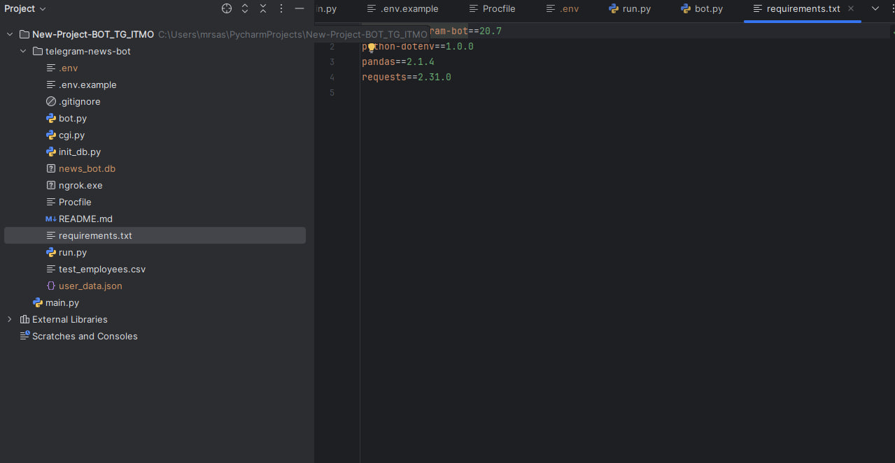
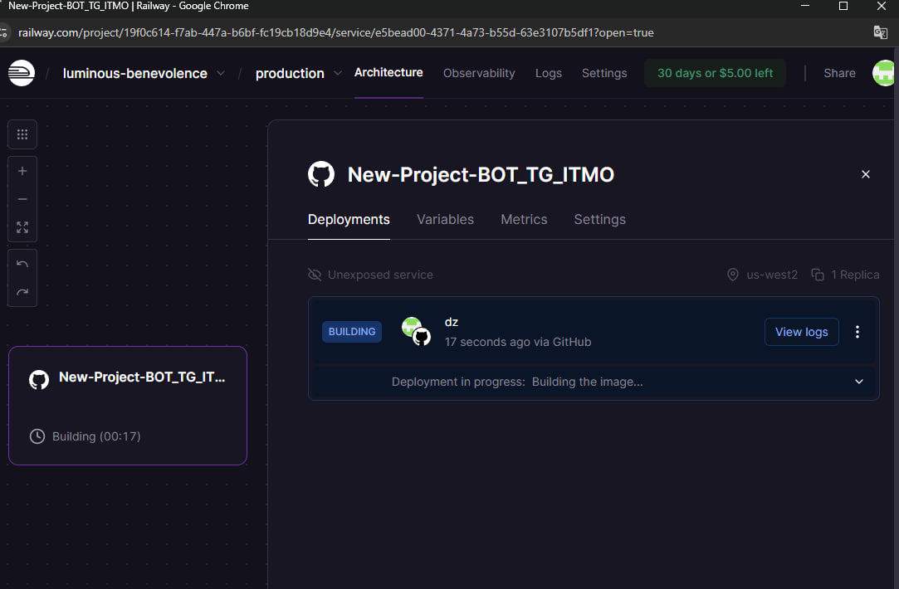
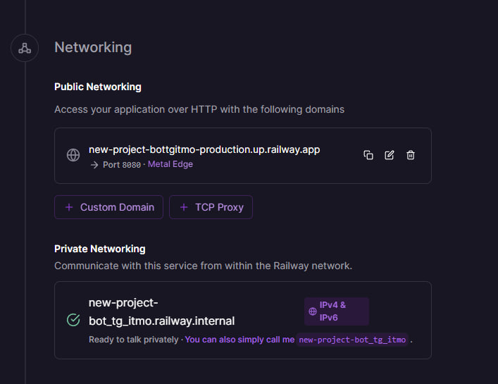
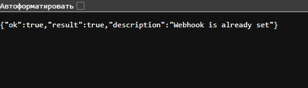
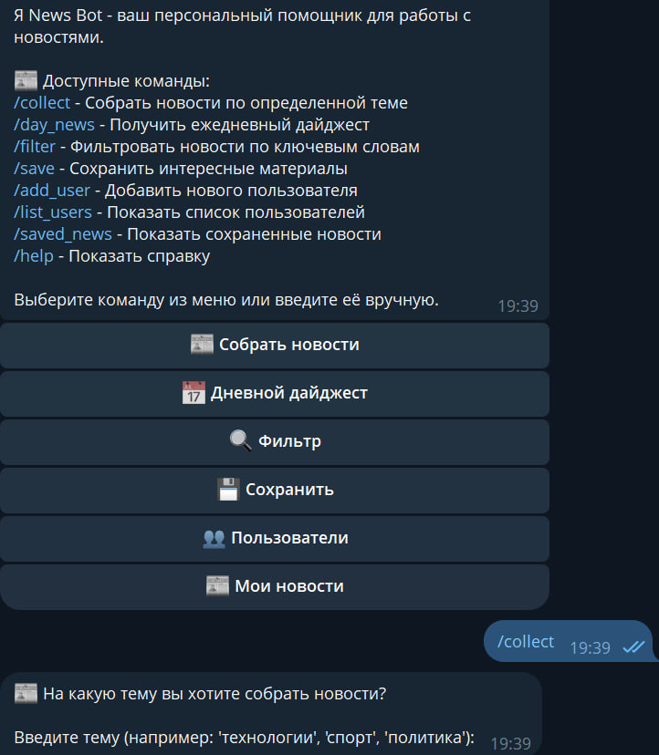

University: [ITMO University](https://itmo.ru/ru/)  
Faculty: [FTMI](https://FTMI.itmo.ru)  
Course: [Vibe Coding: AI-боты для бизнеса](https://github.com/itmo-ict-faculty/vibe-coding-for-business)  
Year: 2025/2026  
Group: U4225  
Author: Budaev Alexandr Sayanovich
Lab: Lab3  
Date of create: 28.10.2025  
Date of finished: 28.10.2025  

---

## 🎯 Цель работы

Научиться развёртывать Telegram-бота в облачной среде с возможностью взаимодействия с реальными пользователями.  
Закрепить навыки:
- настройки окружения и переменных среды;
- работы с вебхуками (`webhook`) Telegram API;
- деплоя приложений на платформе **Railway**;
- подключения GitHub-репозитория и автоматического обновления кода.

---

## ⚙️ Ход выполнения работы

### 1. Подготовка проекта
- Исходный код Telegram-бота размещён в GitHub-репозитории:  
  `https://github.com/Sblrok003/New-Project-BOT_TG_ITMO`
- Основные файлы проекта:
  - `bot.py` — логика бота, обработчики команд;
  - `run.py` — точка входа для запуска приложения;
  - `.env` — хранение токенов и ключей;
  - `requirements.txt` — список зависимостей Python.

---

### 2. Подключение к Railway
1. Создан новый проект **New-Project-BOT_TG_ITMO**.  
2. Репозиторий GitHub подключён к Railway.  
3. Railway автоматически разворачивает окружение при каждом `git push`.

---

### 3. Настройка окружения
Во вкладке **Variables** добавлены переменные среды:

| Переменная | Значение |
|-------------|-----------|
| `BOT_TOKEN` | Токен Telegram-бота |
| `WEBHOOK_PUBLIC_URL` | `https://new-project-bottgimto-production.up.railway.app` |
| `WEBHOOK_LISTEN` | `0.0.0.0` |
| `WEBHOOK_PORT` | `${PORT}` |

---

### 4. Проверка работы
Railway успешно развернул контейнер:
✅ Deployment successful

В логах отображается сообщение:
Запуск в режиме webhook: listen=0.0.0.0:8000

Проверка getWebhookInfo показывает корректный URL:

json
Копировать код
"url": "https://new-project-bottgimto-production.up.railway.app/webhook",
"pending_update_count": 0
После этого бот начал отвечать на команды /start, /help, /collect и т.д.

6. Диагностика и устранение ошибок
В процессе деплоя возникли:

502 Bad Gateway — бот не слушал порт Railway → исправлено добавлением WEBHOOK_PUBLIC_URL.

Failed to fetch при связке с GitHub → решено переподключением репозитория.

После исправлений приложение стабильно запускается и принимает запросы от Telegram.

---

Результаты работы
Telegram-бот успешно развёрнут на облачной платформе Railway.

Настроено автоматическое обновление через GitHub.

Webhook корректно зарегистрирован и получает обновления.

Бот доступен для взаимодействия с пользователями через Telegram.

---
🧩 Вывод
В ходе лабораторной работы я:

изучил принципы работы webhook-механизма Telegram API;

научился деплоить Python-бота на облачный хостинг Railway;

освоил настройку переменных окружения и подключение GitHub-репозитория;

научился диагностировать и устранять типичные ошибки (502, fetch failed).